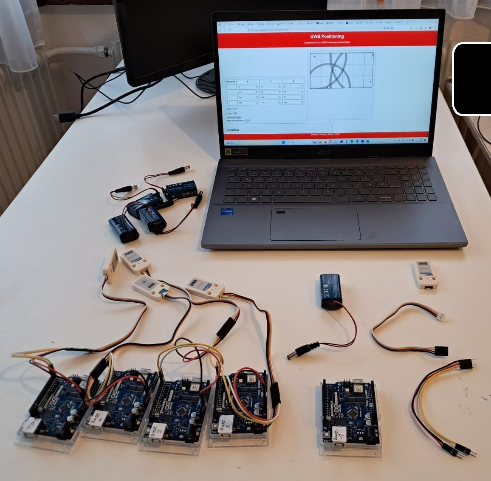

# BA_2024-2025-UWB-Positioning
Repository for my code produced for my first attempt of my bachelor thesis.

The goal was to create a working UWB positioning systems using M5Stack-UWB Sensors coupled with Arduinos, and creating a webserver with XAMPP that recieves, handles, and displays the data and position.

Sadly the written part of my thesis was lacking, resulting in a failed attempt. 

# Description

In a working environment the 4 sensors must first be placed in the edges of a room (anchors), and their positions must be measured, and recorded.
Then the moving sensor (tag) can move around, measure distances using UWB ranging, and transmit the data to the webserver through WLAN and HTTP requests.

The website is used to enter the positions of the anchors, and display the corrsponding measured distances, as well as the approximated position of the moving tag.
The measurements of the tag are stored, and can be viewed live, or saved in sessions and replayed.

